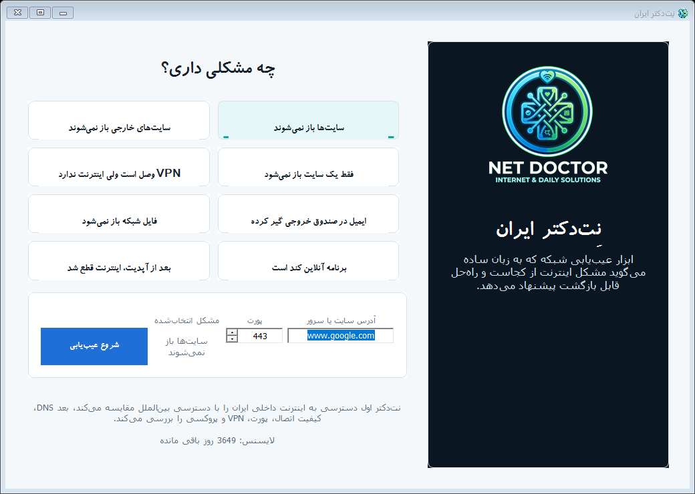
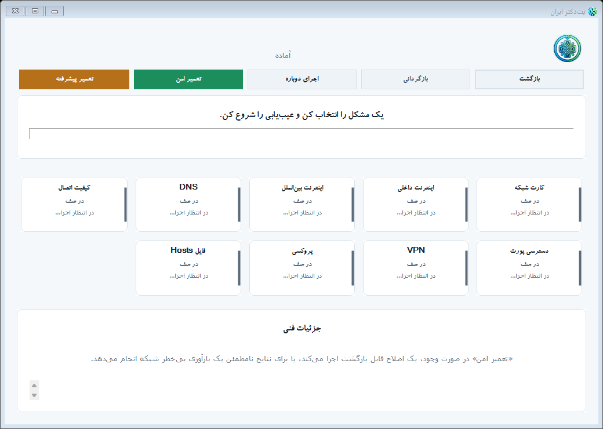

# نِت‌دکتر (Net Doctor)

**دکتر شبکه‌ی ویندوز که به زبان ساده می‌گوید چرا اینترنتت قطع است و آن را امن تعمیر می‌کند.**

[English](README.md) · [فارسی](README.fa.md)

---

نِت‌دکتر یک برنامه‌ی تجاری ویندوز برای کاربران عادی است؛ کسانی که فقط می‌خواهند بدانند **«چرا اینترنتم کار نمی‌کند؟»** — بدون اینکه لازم باشد DNS، گیت‌وی، مسیر، پروکسی، کارت VPN یا تست پورت را بفهمند.

تو مشکلت را انتخاب می‌کنی؛ نِت‌دکتر یک عیب‌یابی هدایت‌شده اجرا می‌کند، به زبان روشن می‌گوید **مشکل از کجاست**، و **تعمیرهای امن و قابل بازگشت** پیشنهاد می‌دهد.

> نِت‌دکتر نرم‌افزار پولی با **لایسنس ماهانه** است. این مخزن فقط شامل معرفی و تصاویر محصول است، نه کد منبع.

## تصاویر

## چرا نِت‌دکتر؟

در خیلی از شبکه‌ها — به‌خصوص در ایران — سؤال «اینترنت وصل است؟» سؤال درستی نیست. سؤال‌های واقعی این‌ها هستند:

- آیا اینترنت **داخلی** در دسترس است؟
- آیا اینترنت **بین‌الملل** در دسترس است؟
- مشکل از **DNS** است، **VPN**، **پروکسی**، **مودم/گیت‌وی**، یا **اپراتور**؟

نِت‌دکتر دقیقاً به همین‌ها جواب می‌دهد و یک راه‌حل تک‌کلیکی و قابل بازگشت پیشنهاد می‌کند.

## امکانات کلیدی

- 🩺 **شروع از روی مشکل** — از علامت مشکل شروع کن، نه از منوهای فنی.
- 🌐 **حکم داخلی/بین‌الملل** — روشن می‌گوید چه چیزی کار می‌کند و چه چیزی نه.
- 🔎 **تشخیص DNS چندمنبعه** — DNS سیستم تو را با چند DNS عمومی (از جمله DNSهای ایرانی مثل **شکن، الکترو و بگذر**) مقایسه می‌کند تا مشخص کند واقعاً مشکل از DNS است یا نه.
- 📶 **بررسی کامل** — کارت شبکه، گیت‌وی، DNS، کیفیت اتصال (تأخیر و اتلاف بسته)، دسترسی پورت TCP، کارت‌های VPN و پروکسی ویندوز.
- 🛠️ **تعمیر امن** — تغییر DNS (با preset)، ریست پروکسی قدیمی، یا بازآوری شبکه — همیشه اول تنظیم قبلی ذخیره می‌شود و **بازگردانی** درون برنامه هست.
- ⚙️ **تعمیر پیشرفته** — ریست کامل پشته‌ی شبکه (Winsock / TCP-IP) پشت یک هشدار روشن، برای سخت‌ترین موارد.
- 🧾 **گزارش به زبان ساده** — یک خلاصه‌ی قابل فهم به‌علاوه‌ی یک لاگ فنی برای کاربران حرفه‌ای.

## نسخه‌ها

| | نِت‌دکتر | نِت‌دکتر — نسخه ایران |
|---|---|---|
| زبان | انگلیسی | فارسی، راست‌به‌چپ |
| هدف‌های داخلی | تشخیص خودکار کشور | تنظیم‌شده برای سایت‌ها و DNSهای ایران |
| مناسب برای | کاربران سراسر دنیا | کاربران داخل ایران |

## لایسنس چطور کار می‌کند؟

نِت‌دکتر به‌صورت **ماهانه** لایسنس می‌شود:

۱. لایسنس را تهیه کن (تماس در پایین) و شناسه‌ی دستگاه (Machine ID) که در صفحه‌ی فعال‌سازی برنامه نشان داده می‌شود را ارسال کن.
۲. یک کلید لایسنس شخصی، مخصوص همان یک کامپیوتر، دریافت می‌کنی.
۳. آن را در صفحه‌ی فعال‌سازی هنگام اولین اجرا وارد کن.
۴. برنامه تا پایان دوره فعال می‌ماند؛ برای ادامه، ماهانه تمدید کن.

هر لایسنس مخصوص نسخه‌ی خودش و یک کامپیوتر مشخص، شخصی و غیرقابل‌انتقال است.

## پیش‌نیازها

- ویندوز ۱۰ یا ۱۱ (۶۴ بیتی)
- دسترسی Administrator فقط هنگام اعمال یک تعمیر درخواست می‌شود

## تهیه‌ی لایسنس / تماس

برای خرید لایسنس، در تلگرام به **[@MiladAteight](https://t.me/MiladAteight)** پیام بده — سریع‌ترین راه تماس با من است؛ قیمت نسخه‌ی مورد نظرت را می‌گویم و کلید لایسنس شخصی‌ات را برایت صادر می‌کنم.

- 💬 **تلگرام:** [@MiladAteight](https://t.me/MiladAteight)
- 📧 **ateight088@gmail.com**
- دانلود و نسخه‌ها: **[نصب‌کننده ایران v0.3.0](https://github.com/miladateight/NetDoctor/releases/download/v0.3.0/NetDoctorIranSetup-0.3.0.exe)**، **[نصب‌کننده گلوبال v0.3.0](https://github.com/miladateight/NetDoctor/releases/download/v0.3.0/NetDoctorSetup-0.3.0.exe)** و صفحه‌ی **[Releases](https://github.com/miladateight/NetDoctor/releases)**

## کپی‌رایت

© ۲۰۲۶ Milad AT8 — تمام حقوق محفوظ است. نِت‌دکتر نرم‌افزار تجاری و اختصاصی است. فایل [LICENSE](LICENSE) را ببین.

