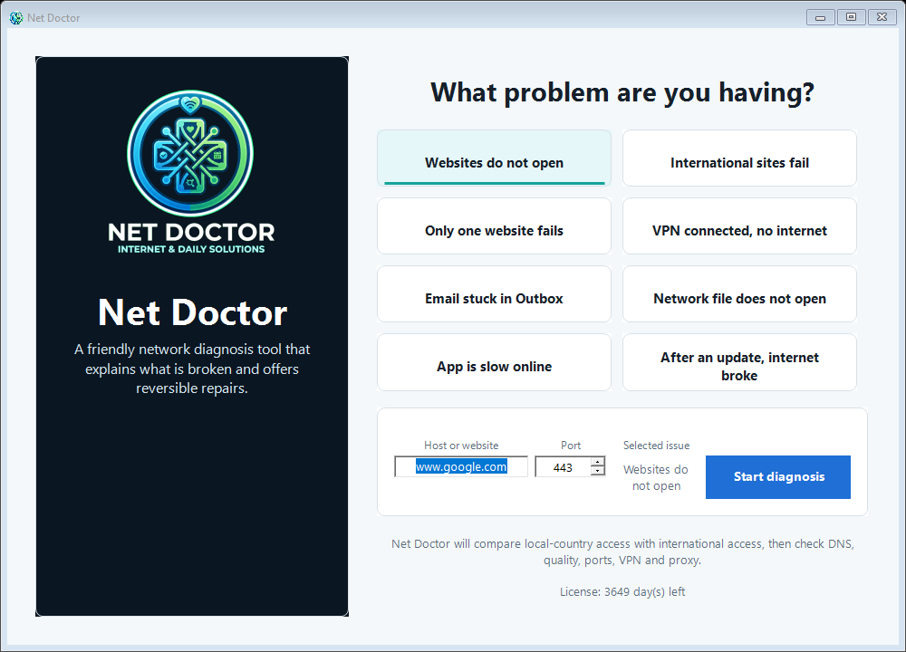
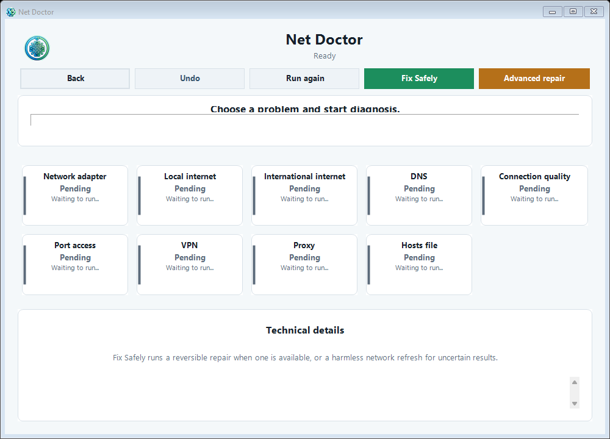

# Net Doctor

**A smart Windows network doctor that tells you — in plain language — why your internet is broken, and fixes it safely.**

[English](README.md) · [فارسی](README.fa.md)

---

Net Doctor is a commercial Windows app for everyday users who just want to know **"why isn't my internet working?"** — without understanding DNS, gateways, routes, proxies, VPN adapters or port tests.

You pick the problem you're facing; Net Doctor runs a guided diagnosis, tells you in clear language **where the fault is**, and offers **safe, reversible repairs**.

> Net Doctor is paid software with a monthly license. This repository contains the product description and screenshots only — not the source code.

🌐 **Project page:** [ateight.xyz/NetDoctor](https://ateight.xyz/NetDoctor/) · 📦 **Downloads:** [Iran installer v0.3.0](https://github.com/miladateight/NetDoctor/releases/download/v0.3.0/NetDoctorIranSetup-0.3.0.exe) · [Global installer v0.3.0](https://github.com/miladateight/NetDoctor/releases/download/v0.3.0/NetDoctorSetup-0.3.0.exe) · [All releases](https://github.com/miladateight/NetDoctor/releases) (a valid license is required to use the app)

## Screenshots

## Why Net Doctor

In many networks — especially in Iran — "is the internet up?" is the wrong question. The real questions are:

- Is **local/internal** internet reachable?
- Is **international** internet reachable?
- Is the fault in **DNS**, **VPN**, **proxy**, the **gateway/modem**, or the **ISP**?

Net Doctor answers exactly these, then proposes a one-click fix you can undo.

## Key features

- 🩺 **Problem-first flow** — start from your symptom, not from technical menus.
- 🌐 **Internal vs international verdict** — clearly says what works and what doesn't.
- 🔎 **Multi-resolver DNS diagnosis** — compares your system DNS against multiple public resolvers (including Iranian DNS such as Shecan, Electro and Begzar) to pinpoint whether DNS is really the problem.
- 📶 **Full checks** — adapter, gateway, DNS, connection quality (latency & packet loss), TCP port reachability, VPN adapters and Windows proxy.
- 🛠️ **Fix Safely** — switch DNS (with presets), reset a stale proxy, or refresh the network — always saving the previous setting first, with **Undo** built in.
- ⚙️ **Advanced repair** — full network-stack reset (Winsock / TCP-IP) behind a clear warning, for the toughest cases.
- 🧾 **Plain-language report** — a human summary plus a technical log for advanced users.

## Editions

| | Net Doctor | Net Doctor — Iran Edition |
|---|---|---|
| Language | English | Persian (فارسی), right-to-left |
| Local targets | Country auto-detected | Tuned for Iranian sites & DNS |
| Best for | Worldwide users | Users in Iran |

## How licensing works

Net Doctor is licensed on a **monthly** basis:

1. Purchase a license (contact below) and send the **Machine ID** shown on the app's activation screen.
2. You receive a personal license key, issued for that one computer.
3. Paste it into the activation screen on first launch.
4. The app stays active for the licensed period; renew monthly to continue.

Each license is bound to its edition and to a single computer, and is personal & non-transferable.

## System requirements

- Windows 10 or Windows 11 (64-bit)
- Administrator permission is requested only when applying a repair

## Get a license / contact

To buy a license, message **[@MiladAteight](https://t.me/MiladAteight) on Telegram** — that's the fastest way to reach me, get your price for the edition you need, and receive your personal license key.

- 💬 **Telegram:** [@MiladAteight](https://t.me/MiladAteight)
- 📧 **ateight088@gmail.com**
- Releases & downloads: **[Iran installer v0.3.0](https://github.com/miladateight/NetDoctor/releases/download/v0.3.0/NetDoctorIranSetup-0.3.0.exe)**, **[Global installer v0.3.0](https://github.com/miladateight/NetDoctor/releases/download/v0.3.0/NetDoctorSetup-0.3.0.exe)** and the **[Releases](https://github.com/miladateight/NetDoctor/releases)** page

## License

© 2026 Milad AT8 — All rights reserved. Net Doctor is proprietary, commercial software. See [LICENSE](LICENSE).
