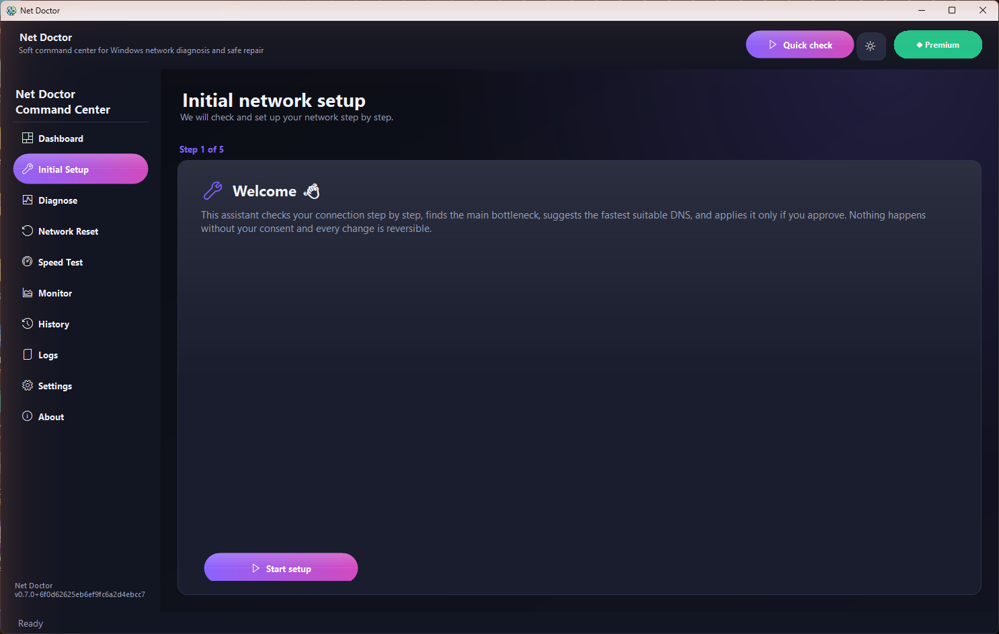

# Net Doctor

**A modern Windows command center for network diagnosis, safe repair, monitoring, history and reports.**

[English](README.md) - [فارسی](README.fa.md)

---

Net Doctor is a Windows desktop application that diagnoses common network and internet problems in plain language, then applies controlled repairs only when the user confirms them. Version `0.8.0` focuses on speed and polish: the whole app now renders in a **single frame** — it opens, and switches between sections, appearing complete instead of assembling itself in visible stages — and adds a **subscription status** card that shows exactly how many days remain on a Premium license and when it expires. It builds on `0.7.0`, which introduced parallel diagnosis, the step-by-step **Initial Setup** wizard, the **bottleneck analyzer**, the live-ping DNS chooser, and **Free and Premium** tiers in one build.

> This repository is intentionally **release-only**. It does not contain source code, tests, build scripts, private licensing keys, or the local license issuer tool. The installer is distributed through GitHub Releases.

## Screenshots

  
  

## Download

- Latest installer: [NetDoctorSetup-0.8.0.exe](https://github.com/miladateight/NetDoctor/releases/download/v0.8.0/NetDoctorSetup-0.8.0.exe)
- SHA256: [NetDoctorSetup-0.8.0.exe.sha256](https://github.com/miladateight/NetDoctor/releases/download/v0.8.0/NetDoctorSetup-0.8.0.exe.sha256)
- All releases: [GitHub Releases](https://github.com/miladateight/NetDoctor/releases)

The app installs and runs without a license in **Free** mode. A valid license unlocks **Premium**.

## Free vs Premium

One build, two access levels — no separate installer, no trial and no time limit. Without a license
(or with an expired one) the app runs in **Free**; a valid license unlocks **Premium**. Premium
features stay visible in the UI with a lock; clicking one opens activation. Your data (history,
snapshots, settings) is never deleted when a license expires — access is simply locked until you
re-activate.

| Free | Premium (everything in Free, plus…) |
| --- | --- |
| Adapter & Gateway checks | Professional dashboard |
| Simple Internet & DNS check | VPN, Proxy, Port & Hosts checks and repairs |
| Active adapter & IP display | Safe Reset, Deep Reset, Winsock & TCP/IP reset |
| Simple ping test | Full Speed Test & Live Monitor |
| Flush DNS repair | History, Logs & TXT/JSON/HTML export |
| Simple dashboard (current result) | DNS change (live-ping chooser) + Initial Setup wizard |
|  | Snapshots & Undo |

## Highlights

- Single-frame rendering: the app opens and switches sections in one frame, with no visible stage-by-stage assembly and instant navigation.
- Subscription status card on the Premium badge: exact days remaining and expiry date (Jalali in the Persian UI), with one-click renew.
- Single running instance: relaunching restores the existing window instead of opening another copy.
- Modern `Soft Command Center` UI with TopBar, Sidebar, Dashboard, StatusBar and tray behavior.
- Theme support: `System`, `Light`, `Dark` with a quick TopBar toggle.
- Runtime language selection: `en`, `de`, `fa`, `ar`.
- RTL layout support for Persian and Arabic.
- Runtime region selection: `World` and `Iran` in one app build.
- First Run Wizard for language, region and theme.
- Guided **Initial Setup** that runs diagnose → bottleneck → DNS → apply → verify in-place.
- **Bottleneck analyzer** that names the first broken link in the connection chain in plain language.
- Parallel diagnosis (roughly the time of the single slowest check instead of the sum).
- DNS chooser that live-pings each resolver and pre-selects the fastest healthy one (domestic and global for Iran).
- Simple and Professional dashboard modes for normal users and power users.
- Dashboard KPI strip for Local, International, DNS and Quality status.
- Status cards for adapter, gateway, internet, DNS, packet loss, port, VPN, proxy and hosts file checks.
- Safe Reset and Deep Reset flows with clear risk wording.
- Speed test with latency, jitter, download, cancel and fallback endpoint.
- Monitor view with latency sparkline and adapter refresh.
- History view for saved sessions, delete and export.
- Logs view with daily log access.
- Report export to `TXT`, `JSON` and `HTML`.

## Safety Model

Net Doctor does not run as administrator by default. The app manifest remains `asInvoker`; UAC is requested only for repairs that require it.

Undo is available only for repairs with real rollback data. Operations such as Winsock reset, TCP/IP reset and full network-stack reset do not promise direct rollback; their snapshots are kept for audit and reporting.

## Requirements

- Windows 10 or Windows 11, 64-bit
- A valid Net Doctor license

## License And Purchase

Net Doctor is proprietary commercial software. A valid, time-limited license is required to use the application. Licenses are personal and non-transferable.

For license purchase and support, contact:

- Telegram: [@MiladAteight](https://t.me/MiladAteight)
- Email: ateight088@gmail.com
- Product page: https://ateight.xyz/NetDoctor/

## Support

GitHub Issues may be used only for public release/download problems. **Do not upload** license keys, logs containing secrets, private network details, or local configuration files.

## License

Copyright (c) 2026 Milad AT8. Net Doctor is proprietary commercial software. See [LICENSE](LICENSE).